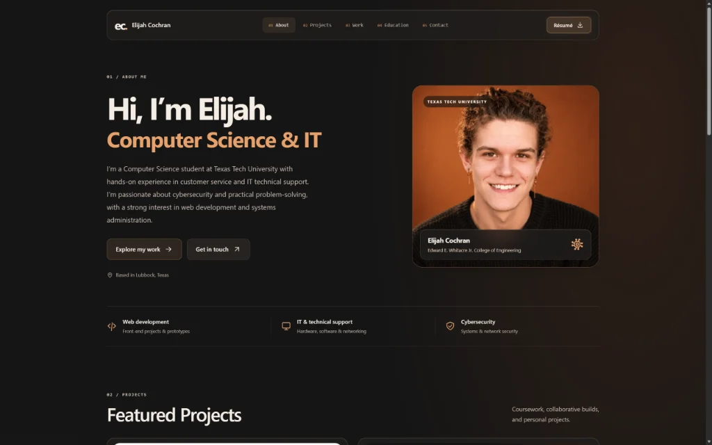

<a href="https://elijah-cochran.com/"></a>
<a href="https://github.com/elijcoch/portfolio-website"></a>

<h1 align="center">Personal Portfolio Website</h1>

<div align="center">

<br />

<br /><br />

**A responsive, high-performance personal portfolio built from scratch with zero frameworks.** <br />
Showcasing computer science coursework, IT support experience, and front-end development projects.

<a href="https://elijah-cochran.com/"></a>
<a href="https://github.com/elijcoch/portfolio-website/issues"></a>
<a href="https://github.com/elijcoch/portfolio-website/issues"></a>

</div>

---

## ✨ Features

- **⚡ Blazing Fast:** Built entirely with vanilla HTML5, CSS3, and JavaScript. Zero external frameworks, libraries, or build dependencies.
- **🎨 Modern UI/UX:** Features a sleek dark theme with glassmorphism (frosted glass) effects, smooth scroll-locked navigation, and responsive typography.
- **📱 Fully Responsive:** Carefully crafted media queries ensure perfect rendering across desktop, tablet, and mobile devices.
- **♿ Accessible (a11y):** Supports keyboard-only navigation, `prefers-reduced-motion`, `prefers-reduced-transparency`, and high-contrast modes.
- **🖼️ Interactive Galleries:** Custom-built native `<dialog>` modals with image sliders for exploring project screenshots.

## 🛠️ Tech Stack

This project takes a "back to basics" approach, proving that modern, beautiful web experiences can be built without heavy frameworks.

| Technology | Purpose |
| :--- | :--- |
| [](https://developer.mozilla.org/en-US/docs/Web/HTML) | Semantic structure, inline SVG iconography, `<template>` based modals |
| [](https://developer.mozilla.org/en-US/docs/Web/CSS) | CSS variables (design tokens), Grid/Flexbox layouts, backdrop-filters, animations |
| [![JavaScript](https://img.shields.io/badge/JavaScript-F7DF1E?style=for-the-badge&logo=data%3Aimage/svg%2Bxml%3Bbase64%2CPHN2ZyB4bWxucz0iaHR0cDovL3d3dy53My5vcmcvMjAwMC9zdmciIHZpZXdCb3g9IjAgMCAxMjggMTI4Ij4KICA8ZGVmcz4KICAgIDxtYXNrIGlkPSJjdXRvdXQiPgogICAgICA8cmVjdCB3aWR0aD0iMTI4IiBoZWlnaHQ9IjEyOCIgZmlsbD0id2hpdGUiIC8%2BCiAgICAgIDxnIGZpbGw9ImJsYWNrIiB0cmFuc2Zvcm09InRyYW5zbGF0ZSg2NCwgNTQpIHNjYWxlKDAuOTIpIHRyYW5zbGF0ZSgtODAuNSwgLTg2LjUpIj4KICAgICAgICA8cGF0aCBkPSJNMTE2LjMgOTYuN2MtLjktNS43LTQuNi0xMC41LTE1LjctMTUtMy44LTEuOC04LjEtMy05LjQtNS45LS41LTEuNy0uNS0yLjYtLjItMy43LjgtMy4zIDQuOC00LjQgNy45LTMuNCAyIC43IDMuOSAyLjIgNS4xIDQuNyA1LjQtMy41IDUuNC0zLjUgOS4yLTUuOS0xLjQtMi4xLTIuMS0zLjEtMy00LTMuMi0zLjYtNy43LTUuNS0xNC44LTUuNGwtMy43LjVjLTMuNS45LTYuOSAyLjctOC45IDUuMi01LjkgNi43LTQuMiAxOC41IDMgMjMuMyA3LjEgNS4zIDE3LjUgNi41IDE4LjkgMTEuNSAxLjMgNi4xLTQuNSA4LjEtMTAuMiA3LjQtNC4yLS45LTYuNi0zLTkuMS02LjktNC43IDIuNy00LjcgMi43LTkuNSA1LjUgMS4xIDIuNSAyLjMgMy42IDQuMyA1LjggOS4xIDkuMiAzMS44IDguNyAzNS44LTUuMi4xLS41IDEuMi0zLjcuMy04LjZ6Ii8%2BCiAgICAgICAgPHBhdGggZD0iTTY5LjUgNTguOUg1Ny44bC0uMSAzMC4zYzAgNi40LjMgMTIuMy0uNyAxNC4xLTEuNyAzLjYtNi4yIDMuMS04LjIgMi40LTIuMS0xLTMuMS0yLjQtNC4zLTQuNS0uMy0uNi0uNi0xLS43LTEuMWwtOS41IDUuOGMxLjYgMy4zIDMuOSA2LjEgNi45IDcuOSA0LjUgMi43IDEwLjUgMy41IDE2LjcgMi4xIDQuMS0xLjIgNy42LTMuNyA5LjQtNy40IDIuNy00LjkgMi4xLTEwLjkgMi4xLTE3LjQuMS0xMC44IDAtMjEuNSAwLTMyLjJ6Ii8%2BCiAgICAgIDwvZz4KICAgIDwvbWFzaz4KICA8L2RlZnM%2BCiAgPHBhdGggZmlsbD0iIzMzMzMzMyIgbWFzaz0idXJsKCNjdXRvdXQpIiBkPSJNMTguOCAxMTQuMUw4LjcgMS4zaDExMC40bC0xMCAxMTIuOC00NS4yIDEyLjUtNDUuMS0xMi41eiIvPgo8L3N2Zz4%3D&logoColor=white)](https://developer.mozilla.org/en-US/docs/Web/JavaScript) | IntersectionObserver scroll tracking, modal state management, gallery controllers |
| [](https://git-scm.com/) | Version control, branch management, and GitHub repository workflows |
| [](https://pages.github.com/) | Fast, secure, and reliable static site hosting |
| [](https://www.squarespace.com/) | Custom domain registrar and DNS management |

## 🚀 Getting Started

To run the site locally, you don't need npm, node, or any build tools. Just clone and serve!

### Prerequisites
- Python 3.x (or any basic local HTTP server)

### Installation
1. Clone the repo
   ```sh
   git clone https://github.com/elijcoch/portfolio-website.git
   ```
2. Navigate to the project directory
   ```sh
   cd portfolio-website
   ```
3. Start a local server
   ```sh
   python -m http.server 8000
   ```
4. Open your browser and visit `http://localhost:8000`

## 📁 Repository Structure

```text
portfolio-website/
├── index.html                 # Main entry point and content
├── assets/
│   ├── css/style.css          # Design tokens and all styling
│   ├── js/script.js           # Modal logic and scroll observers
│   ├── images/                # Highly compressed WebP assets
│   └── docs/                  # Downloadable resumes/documents
└── CNAME                      # Custom domain configuration
```

## 🧠 Design Architecture

*   **Design Tokens:** The top of `style.css` contains all CSS variables controlling the warm charcoal/amber palette, sizing, and shadows.
*   **Template Injection:** Project and employer details live in hidden `<template>` elements. When a user clicks to view details, Vanilla JS clones the template into a single, shared, native `<dialog>` element, ensuring a lightweight DOM.
*   **Intersection Observer:** The navigation bar highlights the active section dynamically by tracking scroll positions using the `IntersectionObserver` API.
*   **Asset Optimization:** All images are heavily compressed into `.webp` format and utilize `loading="lazy"` where appropriate to ensure near-instant page loads.

## 📄 License

Distributed under the MIT License. See `LICENSE` for more information.

Third-party logos, personal documents, photographs, and project materials retain their respective ownership.

<div align="center">
  <br />
  <p>Built by <b>Elijah Cochran</b></p>
  <a href="https://github.com/elijcoch"></a>
  <a href="https://www.linkedin.com/in/elijah-cochran"></a>
  <a href="https://x.com/elijah_cochran_"></a>
</div>
